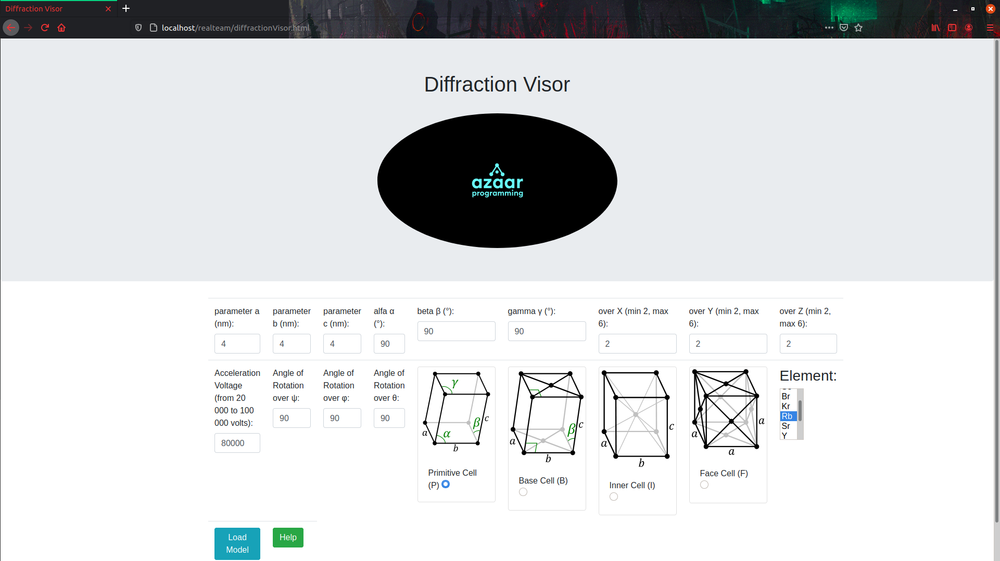
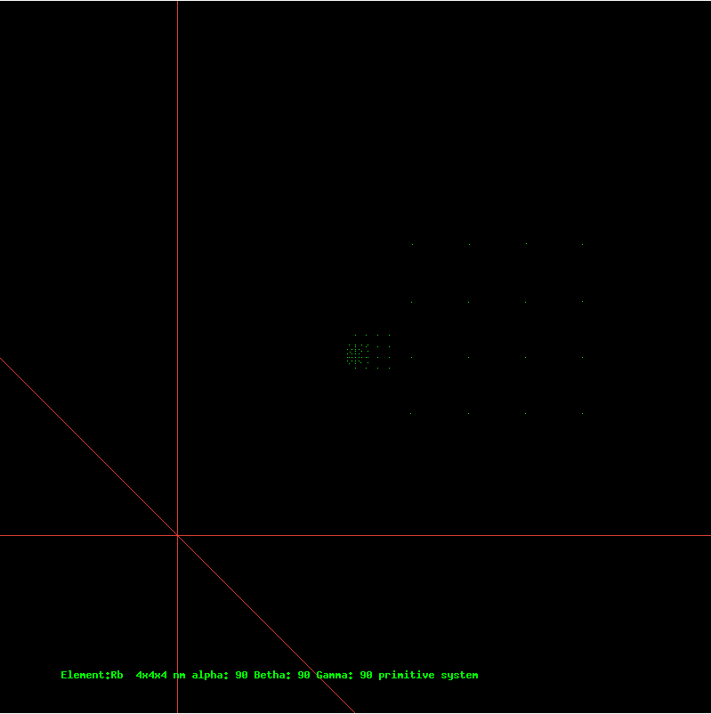
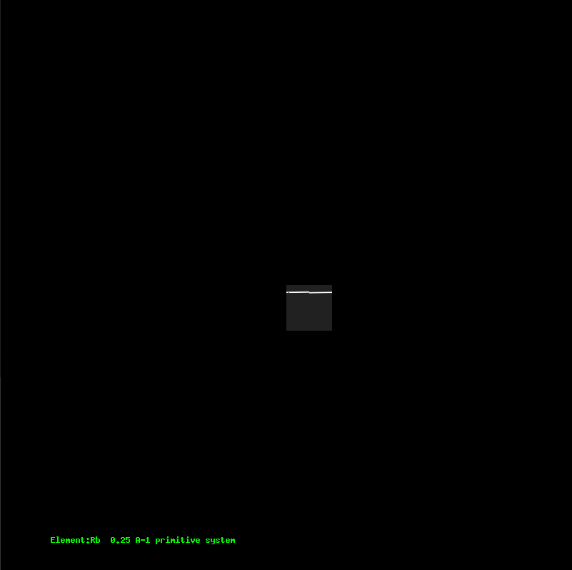
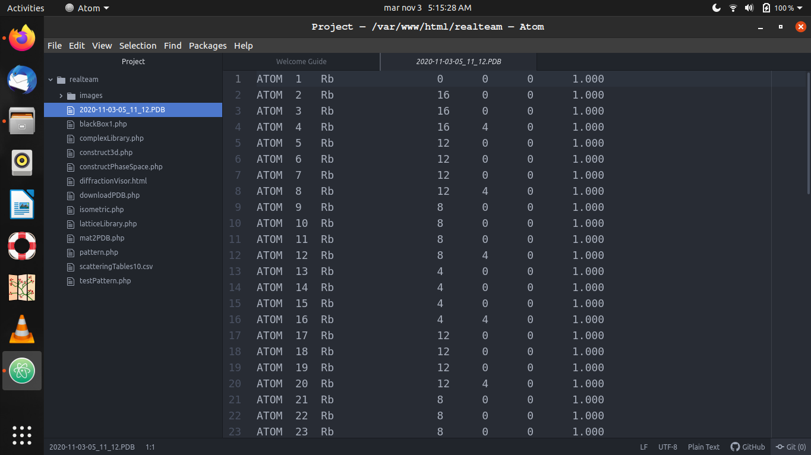

# Welcome to Diffraction Visor

## What's Diffraction Visor?

Diffraction Visor is a web-application that let you see the phase pattern
of a group a molecules that you define according to the TEM [Transmission
Electron Microscopy]
(https://en.wikipedia.org/wiki/Transmission_electron_microscopy) simulation.

Understanding the TEM simulator pattern is key to understanding Diffraction
Visor. Diffraction Visor divides the operation in construct 3D, construct
Phase Space and download PDB file, each with a specific responsibility.



Once copied the master_folder to the "htdocs", or the "html" folder, type the following URL in a web browser:

http://localhost/{project_folder}/diffractionVisor.html
##construct 3D


The _**construct 3D**_ represents the isometric model of the group of
molecules that we set(real world view).

   +--------+
  /        /|
 /        / |
+--------+  |
|        |  |
|        |  +
|        | /
|        |/
+--------+

##construct Phase Space


The _**construct Phase Space**_ represents the phase space diagram [Diffraction
  pattern](https://en.wikipedia.org/wiki/Diffraction#Patterns), this Patterns
  let the user analyze the sample and get characteristics of the material
  with the given parameters.

##download PDB


The _**download PDB**_ is an utility that let you save the model in a
pdb archive[Protein Data Bank](http://www.wwpdb.org/), that has become
a standard for information about the 3D structures of proteins,
nucleic acids, and complex assemblies in case you want to test
your molecular structure in other software.

## Elements of the model:

###parameter a,b,c (nm):

The parameter of the unit cell defined in nanometers(nm).
   5-------6
  /|      /|
 / |     / |
1--|----2  |
|  7----|--8
| /     | /
3-------4

###alpha &alpha;,beta &beta;,gamma &gamma; (°):

The angles between each edge of the cuboid.

###number of cells over X,Y,Z axis(min 2, max 6):

The number of cells for each axis; example if you put 2;
Is 2 cells from 0 to +2x and from 0 to -2x.

###Angles of Rotation (&psi;,&phi;,&theta;):

The angle of rotation is a measurement of the angle, that a figure is
rotated about a fixed point.

###Acceleration Voltage (from  20 000 to 100 000 volts):

The Acceleration Voltage would be the definition of image, is an analog of the
current that pass through the sample in the
TEM (Transmission_electron_microscopy).

###Crystalline System(Primitive(P),Base(B),Inner(I),Face(F)):

The Crystalline System (https://en.wikipedia.org/wiki/Crystal_structure)
available to construct the cells are:

####Primitive(P)

Like a regular cuboid.
   +--------+
  /|       /|
 / |      / |
+--|-----+  |
|  |     |  |
|  +-----|--+
| /      | /
|/       |/
+--------+

####Base(B)

With one atom in the base of the cuboid.
   +--------+
  /|  *    /|
 / |      / |
+--|-----+  |
|  |     |  |
|  +-----|--+
| /   *  | /
|/       |/
+--------+

####Inner(I)

With one atom in the center of the cuboid.
   +--------+
  /|       /|
 / |      / |
+--|-----+  |
|  |   * |  |
|  +-----|--+
| /      | /
|/       |/
+--------+

####Face(F)

With one atom in each face of the cuboid.
   +--------+
  /|       /|
 / |  *   / |
+--|-----+  |
|* |   * | *|
|  +-*---|--+
| /   *  | /
|/       |/
+--------+

###Elements:
The elements available to construct the cells are:
H,He,Li,Be,B,C,N,O,F,Ne,Na,Mg,Al,Si,P,S,Cl,Ar,K,Ca,Sc,Ti,V,Cr,Mn,Fe,Co,Ni,Cu,
Zn,Ga,Ge,As,Se,Br,Kr,Rb,Sr,Y,Zr,Nb,Mo,Tc,Ru,Rh,Pd,Ag,Cd,In,Sn,Sb,Te,I,Xe,Cs,
Ba,La,Ce,Pr,Nd,Pm,Sm,Eu,Gd,Tb,Dy,Ho,Er,Tm,Yb,Lu,Hf,Ta,W,Re,Os,Ir,Pt,Au,Hg,
Tl,Pb,Bi,Po,At,Rn,Fr,Ra,Ac,Th,Pa,U,Np,Pu,Am,Cm,Bk,Cf.
More heavier the element is more defined the Phase pattern.

## Getting Started

###linux install

1. first update your debian distro as example Ubuntu:

```bash
sudo apt-get update
```

2. and then install the LAMP stack (the "^" is necessary):

```bash
sudo apt-get install lamp-server^
```

3. After this copy all the folder to the "/var/www/html/" path.

4. Finally type the following URL in a web browser:

http://localhost/{project_folder}/diffractionVisor.html

5. error log file is located in
```bash
/var/log/apache2/error.log
```
###Windows install


1. Install a wamp server from your trusted sites,(I recommend https://www.apachefriends.org/).

2. After this copy all the folder to the path:

```basic
\xampp\htdocs
```
4. Finally type in the following URL in a web browser:

http://localhost/{project_folder}/diffractionVisor.html

5. error log file is located in
```bash
/var/log/apache2/error.log
```

###OS X install


1. Install a xamp server from your trusted sites,(I recommend https://www.apachefriends.org/).

2. After this copy all the folder to the "htdocs" path.

3. Type in the following URL in a web browser:

http://localhost/{project_folder}/DiffractionVisor.html

## Contributing

We encourage you to contribute to Diffraction Visor! Soon will be a web page
to all the petitions and changes, but for now please send to:
```bash
luisro5@hotmail.com
luisro5azaar@gmail.com
```
## License

DiffractionVisor is released under the [MIT License](https://opensource.org/licenses/MIT).

### Author

* **Luis Roberto Azaar Meza** (CFATA, UNAM)

### Reference

Azaar Meza, Luis Roberto. (2015). "Simulación de estructuras cristalinas y de formación de patrones de difracción de electrones". (Tesis de Maestría). Universidad Nacional Autónoma de México, México. Recuperado de https://repositorio.unam.mx/contenidos/65327
```
@article{Simulación de estructuras cristalinas y de formación de patrones de difracción de electrones,
  title={Simulación de estructuras cristalinas y de formación de patrones de difracción de electrones},
  author={Azaar Meza, Luis Roberto},
  journal={https://repositorio.unam.mx/contenidos/65327},
  year={2015}
}
```

### Contact

```bash
e-mail:luisro5azaar@gmail.com
```
